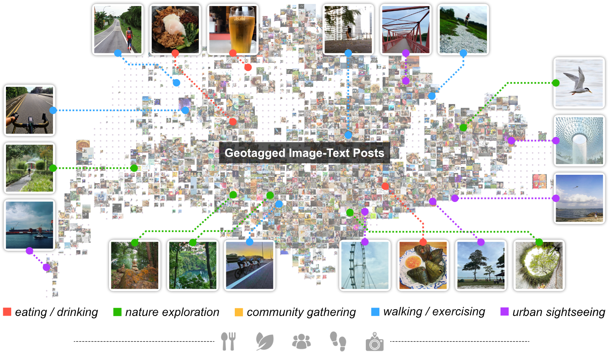

# <div align="center">Socio-spatial variation of urban comfort potential in a global city</div>

<div align="center">

**[Sijie Yang](https://sijie-yang.com)**<sup>a,b</sup>, **[Zdravko Trivic]()**<sup>a</sup>, **[Yihan Zhu]()**<sup>a</sup>, **[Mahmoud Abdelrahman]()**<sup>a</sup>, **[Filip Biljecki](https://filipbiljecki.com)**<sup>a,c,*</sup>

<sup>a</sup> Department of Architecture, National University of Singapore  
<sup>b</sup> School of Engineering and Applied Science, University of Pennsylvania  
<sup>c</sup> Department of Real Estate, National University of Singapore  
<sup>*</sup> Corresponding author: filip@nus.edu.sg

</div>

<div align="center">

[](https://creativecommons.org/licenses/by/4.0/)

</div>

<br>

<div align="center">
<div style="display: flex; justify-content: center; align-items: center; gap: 20px; margin-bottom: 30px;">


</div>
<a href="https://ual.sg">Urban Analytics Lab</a>
</div>

<br>

<div align="center">



</div>

## News

- **2025-09-22**: Release of first version of project data and code.

## Todo

- [x] Update the first version of data and code for this project.
- [ ] Update a second version of data and code with more details.

## Key Features

### 🏙️ Urban Comfort Index (UCI) Analysis
- **Multi-activity Assessment**: Evaluation across 5 social activities:
  - Eating & Drinking
  - Nature Exploration  
  - Community Gathering
  - Walking & Exercising
  - Urban Sightseeing

### 📊 Comprehensive Data Integration
- **Spatial Perception (SP)**: Environmental comfort factors including temperature, humidity, wind, greenery, and shading
- **Functional Convenience (FC)**: Ratings and density analysis for various urban amenities
- **Accessibility (AC)**: Transportation and connectivity metrics
- **Context Density (CD)**: Population and building density analysis
- **Social Activity (SA)**: Activity-specific comfort measurements

### 🎯 Predictive Urban Comfort Index (pUCI)
- **5 Strategic Policies**:
  - pUCI_1: Balanced Development
  - pUCI_2: Eco-Livable
  - pUCI_3: Community Cohesion
  - pUCI_4: Active Walkability
  - pUCI_5: Tourism Strategy

### 🔧 Advanced Optimization
- **Ising Model Optimization**: Advanced algorithms for spatial optimization across 9 key urban features
- **Geospatial Analytics**: Over 675 optimization result files with comprehensive spatial analysis
- **Interactive Visualization**: Multi-level mapping and heatmap analysis

## Data Structure

```
Data/
├── Data_UCI_pUCI.gpkg          # Main UCI and pUCI dataset
└── Optimisation_Result/        # 675 optimization result files
    ├── *.gpkg (630 files)      # Geospatial optimization results
    └── *.csv (45 files)        # Statistical summaries
```

## Getting Started

### Prerequisites

- Python 3.8+
- Required packages:
  - `geopandas` - Geospatial data processing
  - `matplotlib` - Data visualization
  - `pandas` - Data analysis
  - `numpy` - Numerical computing

### Installation

```bash
git clone https://github.com/Sijie-Yang/Urban-Comfort-Potential.git
cd Urban-Comfort-Potential
pip install geopandas matplotlib pandas numpy
```

## Usage

### Quick Start
Run the main analysis notebook:
```bash
jupyter notebook RunMe.ipynb
```

### Main Analysis Pipeline

1. **Load UCI Data**: Import comprehensive urban comfort index dataset
2. **Visualize UCI Patterns**: Generate 5-level classification maps for each social activity
3. **Optimization Analysis**: Load and analyze 45 policy-feature combinations
4. **Results Visualization**: Create comprehensive heatmaps and statistical summaries

## Contributing

Contributions are welcome! Please feel free to submit a Pull Request.

## License

This work is licensed under a [Creative Commons Attribution 4.0 International License](https://creativecommons.org/licenses/by/4.0/).

You are free to:
- **Share** — copy and redistribute the material in any medium or format
- **Adapt** — remix, transform, and build upon the material for any purpose, even commercially

Under the following terms:
- **Attribution** — You must give appropriate credit, provide a link to the license, and indicate if changes were made. You may do so in any reasonable manner, but not in any way that suggests the licensor endorses you or your use.

[](https://creativecommons.org/licenses/by/4.0/)

## Contact

- Author: Sijie Yang
- GitHub: [@Sijie-Yang](https://github.com/Sijie-Yang)
