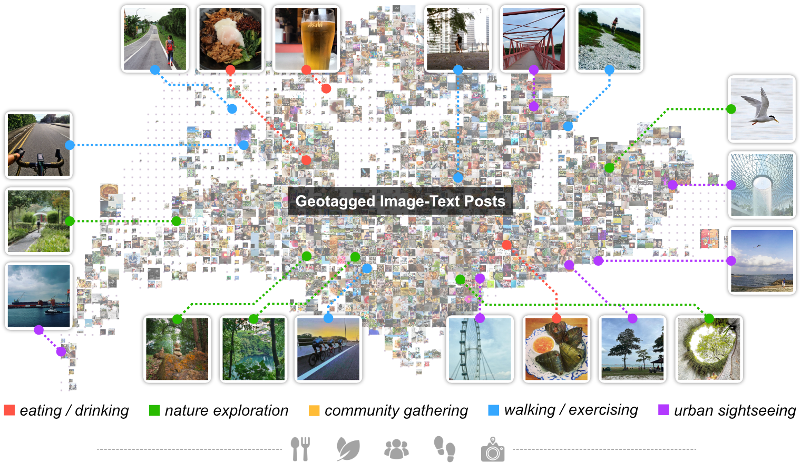

<div align="center">

# Computational Urban Comfort Indexing and Annealed Optimisation for Latent Potentials

**[Sijie Yang](https://sijie-yang.com)**<sup>a,b</sup>, **[Zdravko Trivic]()**<sup>a</sup>, **[Yihan Zhu]()**<sup>a</sup>, **[Mahmoud Abdelrahman]()**<sup>a</sup>, **[Filip Biljecki](https://filipbiljecki.com)**<sup>a,c,*</sup>

<sup>a</sup> Department of Architecture, National University of Singapore  
<sup>b</sup> School of Engineering and Applied Science, University of Pennsylvania  
<sup>c</sup> Department of Real Estate, National University of Singapore  
<sup>*</sup> Corresponding author: filip@nus.edu.sg

</div>

<div align="center">

[](https://creativecommons.org/licenses/by/4.0/)

</div>

<br>

<div align="center">
<div style="display: flex; justify-content: center; align-items: center; gap: 20px; margin-bottom: 30px;">


</div>
<a href="https://ual.sg">Urban Analytics Lab</a>
</div>

<br>

<div align="center">



</div>

## News

- **2025-09-22**: Release of first version of project data and code.
- **2026-03-16**: Added full details of project implementation.
- **2026-04-14**: Updated the whole workflow, especially release post embedding data, and new optimisation process.

## Todo

- [X] Update the first version of data and code for this project.
- [X] Update a full-detail version of data and code with more details.
- [X] Continue to refine and adjust the framework.
- [ ] Extend this framework to first 10 global cities.
- [ ] Extend this framework to more global cities.

## Abstract

Urban comfort shapes how people inhabit cities and can be assessed through modelling of environmental and social conditions. Beyond these observable states lies urban comfort potential—the latent scope for improving comfort across activities and places—which remains largely invisible without systematic analysis.

We examine Singapore as a global city, analysing **44,228 geotagged image–text posts** to classify five activity types and link them to spatial features using surveys and causal inference. A hybrid urban comfort index achieves strong validation (**R² > 0.8** across all activity categories) and, combined with **Ising Monte Carlo optimisation**, enables targeted simulations of improvement strategies.

**Keywords:** human-centred GeoAI, urban optimisation, urban planning, social media, geospatial modelling

## Key Features

### 🏙️ Urban Comfort Index (UCI) Analysis

- **Multi-activity Assessment**: Evaluation across 5 social activities:
  - Eating & Drinking
  - Nature Exploration
  - Community Gathering
  - Walking & Exercising
  - Urban Sightseeing

### 📊 Comprehensive Data Integration

- **Streetscape Perception (SP)**: Environmental comfort factors including greenery, shading, imageability, and human scale
- **Functional Convenience (FC)**: Point-of-interest ratings, density analysis, and user reviews
- **Accessibility (AC)**: Transportation connectivity and transit access metrics
- **Context Density (CD)**: Population, building, and leisure space density analysis

### 🎯 Policy-weighted Urban Comfort Index (pUCI)

- **5 Strategic Planning Scenarios**:
  - pUCI_1: Balanced Development
  - pUCI_2: Eco-Livable City Initiative
  - pUCI_3: Community Cohesion Drive
  - pUCI_4: Active Walkability Focus
  - pUCI_5: Tourism Strategy Development

### 🔧 Advanced Optimization Framework

- **Ising Monte Carlo Optimization**: Systematic spatial optimization with simulated annealing
- **Causal Inference**: Identifying activity-specific spatial drivers using causal forest models
- **Socio-spatial Variation Analysis**: Understanding policy-sensitive vs location-sensitive features
- **Geospatial Modelling**: HGWR-based UCI construction with hybrid weighting approach

## Repository Structure

| Notebook | Description | Main inputs | Main outputs |
|----------|-------------|-------------|--------------|
| **code_0** | Social media post embedding analytics | Precomputed post-level features in `data_post_embedding/` (see below) | Clustering & validation metrics, caption-based comfort scores, `data_post_embedding/data_social_activity.gpkg` with `social_activity_comfort_*`, `caption_analytics_results.csv` |
| **code_1** | Social Activity Data | Raw social media / activity data | Activity counts, Moran's I, LISA maps |
| **code_2** | Geospatial Data | — | `data_geospatial.gpkg` (SP, FC, AC, CD features) |
| **code_3** | Social Activity Field (UCI Part 1) | `data_social_activity.gpkg`, `data_geospatial.gpkg` | `data_uci_modelling.gpkg` (features + field targets) |
| **code_4** | Causal Forest Analytics (UCI Part 2) | `data_uci_modelling.gpkg` | `data_uci_dimension_causal_importance.json` |
| **code_5** | Resident & Expert Survey (UCI Part 3) | `data_resident_survey_results.csv` | Hybrid weights (used in code_6) |
| **code_6** | UCI Modelling (UCI Part 4) | `data_uci_modelling.gpkg`, `data_uci_hybrid_weighting.json` | `data_uci_modelling_with_preds_uci.gpkg`, model tables |
| **code_7** | UCI Optimisation / pUCI (UCI Part 5) | `data_uci_modelling_with_preds_uci.gpkg` | pUCI scores, `optimisation_result*/` (Ising results) |
| **code_8** | Result Analytics | `data_uci_puci.gpkg`, `data/optimisation_result/` | UCI/pUCI visualisation, delta-UCP, socio-spatial variation, PCA, district classification |

## Data Structure

### `data/`

Main UCI / pUCI pipeline assets (paths relative to repository root).

```
data/
├── data_administrative_districts.geojson   # Administrative boundaries (code_8)
├── data_geospatial.gpkg                    # Geospatial features SP/FC/AC/CD (code_2 → code_3)
├── data_social_activity.gpkg               # Social activity counts (code_1 → code_3)
├── data_resident_survey_results.csv        # Resident survey (code_5)
├── data_uci_modelling.gpkg                 # Features + activity field targets (code_3 → code_4, code_6)
├── data_uci_modelling_with_preds_uci.gpkg  # UCI predictions (code_6 → code_7)
├── data_uci_puci.gpkg                      # UCI + pUCI scores (code_7 → code_8)
├── data_uci_social_activity_field.gpkg     # Activity field (code_3)
├── data_uci_dimension_causal_importance.json  # Causal importance (code_4)
├── data_uci_hybrid_weighting.json         # Hybrid weights (code_5 → code_6)
├── table_model_comparison.csv              # Model comparison (code_6)
├── table_model_mean.csv                    # Model metrics (code_6)
├── optimisation_result/                    # Ising optimisation results (code_7 output; used by code_8)
└── optimisation_result_user/               # Optional user output folder (code_7)
```

### `data_post_embedding/`

Post-level multimodal embeddings and caption comfort for **44,228** aligned posts (code_0). Paths relative to repository root.

```
data_post_embedding/
├── dataset_post_embedding_grid_id.npy      # Post rows ↔ grid `id`
├── grid_point_coordinates.csv              # Grid point coordinates / ids for mapping
├── embedding_index_grid_cluster.csv        # Cluster labels per post (+ grid linkage)
├── cluster_activity_config.json            # Cluster → activity label mapping
├── dataset_post_*_features.npy             # Image embeddings: SigLIP2, ResNet, ViT (ablation & clustering)
├── dataset_post_st_caption_features.npy    # Sentence-transformer caption vectors (comfort §4)
├── dataset_post_caption_has_text.npy       # Text-present mask for captions
├── dataset_post_comfort_*.npy             # Comfort: anchor sims, raw / normalised scores
├── dataset_post_caption_activity.npy       # Per-post activity from cluster + config
├── data_social_activity.gpkg               # Activity intensity GPKG; §5 adds social_activity_comfort_*
└── caption_analytics_results.csv           # Aggregated caption / comfort analytics
```

Other tensors in this folder (e.g. gated SigLIP2, gate λ, image path lists) follow the same naming pattern; see `code_0_social_media_post_embedding.ipynb` for the complete inventory.

**Large `*features.npy` files** (SigLIP2 / ResNet / ViT / sentence-transformer caption vectors) are **not stored in this GitHub repo** — they are published on **Hugging Face** to avoid oversized clones. After cloning GitHub, download them with the script below ([Hugging Face](#hugging-face-post-embedding-features)).

### Hugging Face (post embedding features)

| Item | Purpose |
|------|---------|
| `scripts/download_post_embedding_features.py` | Pulls every `*features.npy` from a HF **dataset** repo into `data_post_embedding/` |
| `scripts/upload_post_embedding_features.py` | Maintainer: uploads local `data_post_embedding/*features.npy` to a HF dataset repo |

Default dataset id (override with env **`HF_POST_EMBEDDING_REPO`**): `Sijie-Yang/urban-comfort-potential-post-embedding-features` — **create this repo on Hugging Face** under your account before the first upload, or pass `--create-repo` once.

**Download (users & reproducibility)**

```bash
pip install -U huggingface_hub
huggingface-cli login          # optional for public datasets; required if the dataset is private

export HF_POST_EMBEDDING_REPO=Sijie-Yang/urban-comfort-potential-post-embedding-features
python scripts/download_post_embedding_features.py
```

**Upload (maintainers — after `*features.npy` exist locally)**

1. [Create a dataset](https://huggingface.co/new-dataset) (e.g. `urban-comfort-potential-post-embedding-features`) or run upload with `--create-repo`.
2. Log in: `huggingface-cli login` (token with **write** on that namespace).
3. Run:

```bash
export HF_POST_EMBEDDING_REPO=YOUR_USERNAME/urban-comfort-potential-post-embedding-features
python scripts/upload_post_embedding_features.py --create-repo   # omit --create-repo if the repo already exists
```

This uploads each file whose name ends with `features.npy` (flat layout at the dataset root). For manual uploads, use the [Hugging Face web UI](https://huggingface.co/docs/hub/datasets-upload-guide) **Add file** or:

```bash
huggingface-cli upload YOUR_USERNAME/urban-comfort-potential-post-embedding-features \
  data_post_embedding/dataset_post_resnet_features.npy --repo-type dataset
# repeat per file, or use the Python script above
```

## Getting Started

### Prerequisites

- **Python 3.10–3.11** recommended (matches `requirements.txt`; avoids common conflicts with older stacks)
- **Jupyter** — included in `requirements.txt` (`jupyter`, `ipykernel`); or open `.ipynb` in VS Code / Cursor with the same interpreter

Dependencies for **code_0–code_8** are pinned in **`requirements.txt`** (geospatial, ML, causal inference, sentence-transformers, Qiskit, etc.). Use a fresh virtual environment or conda env when possible.

### Installation

```bash
git clone https://github.com/Sijie-Yang/Urban-Comfort-Potential.git
cd Urban-Comfort-Potential

python -m venv .venv          # optional but recommended
source .venv/bin/activate     # Windows: .venv\Scripts\activate

pip install --upgrade pip
pip install -r requirements.txt
```

If you only need a subset of notebooks, you can still start from `requirements.txt` and remove unused sections after reading the file comments, or install packages manually—but the full list is the supported reference.

## Usage

### Pipeline order

Notebooks can be run in sequence to reproduce the full pipeline, or run individually if the required data files already exist:

0. **code_0** *(optional, embedding & comfort branch)* — Post-level embedding ablation, clustering, caption comfort, merge into `data_post_embedding/data_social_activity.gpkg`  
1. **code_1** — Social activity data and spatial autocorrelation  
2. **code_2** — Geospatial feature preparation → `data/data_geospatial.gpkg`  
3. **code_3** — Social activity field + merge → `data/data_uci_modelling.gpkg`  
4. **code_4** — Causal forest analytics → `data/data_uci_dimension_causal_importance.json`  
5. **code_5** — Resident & expert survey → hybrid weights for code_6  
6. **code_6** — UCI modelling (HGWR, hybrid weighting) → `data/data_uci_modelling_with_preds_uci.gpkg`  
7. **code_7** — pUCI and Ising optimisation → `data/data_uci_puci.gpkg`, `data/optimisation_result/` (or `optimisation_result_user/`)  
8. **code_8** — Result analytics (UCI/pUCI maps, optimisation summaries, socio-spatial variation, delta-UCP, PCA, district classification)

```bash
jupyter notebook code_0_social_media_post_embedding.ipynb   # post embeddings & caption comfort (optional branch)
# or
jupyter notebook code_1_social_activity_data.ipynb   # start from core pipeline
# or
jupyter notebook code_8_result_analytics.ipynb        # run analytics if data already exist
```

**Note:** Each notebook (and each main section marked with `##`) can be run independently where inputs are available.

### What each notebook does

- **code_0**: Loads precomputed post embeddings (image + caption), compares representation backbones, runs clustering linked to grid ids, derives caption-based comfort scores (sentence-transformer anchors), and can write comfort-enriched fields back to `data_post_embedding/data_social_activity.gpkg` for mapping.
- **code_1–code_3**: Build activity and geospatial inputs and the unified modelling dataset (`data_uci_modelling.gpkg`).
- **code_4**: Causal forest on activity-field targets; output used with code_5 for hybrid weights.
- **code_5**: Survey processing and expert weights; combined with causal weights in code_6.
- **code_6**: Model comparison and final UCI modelling; produces UCI predictions and `data_uci_modelling_with_preds_uci.gpkg`.
- **code_7**: Computes pUCI, runs Ising Monte Carlo optimisation per pUCI × feature, writes optimisation result GeoPackages and CSVs.
- **code_8**: Loads UCI/pUCI and optimisation results; produces visualisations, delta-UCP, socio-spatial variation, PCA, and district-level classification.

## Contributing

Contributions are welcome! Please feel free to submit a Pull Request.

## License

This work is licensed under a [Creative Commons Attribution 4.0 International License](https://creativecommons.org/licenses/by/4.0/).

You are free to:

- **Share** — copy and redistribute the material in any medium or format
- **Adapt** — remix, transform, and build upon the material for any purpose, even commercially

Under the following terms:

- **Attribution** — You must give appropriate credit, provide a link to the license, and indicate if changes were made. You may do so in any reasonable manner, but not in any way that suggests the licensor endorses you or your use.

[](https://creativecommons.org/licenses/by/4.0/)

## Contact

- Author: Sijie Yang (sijiey@u.nus.edu)
- GitHub: [@Sijie-Yang](https://github.com/Sijie-Yang)
